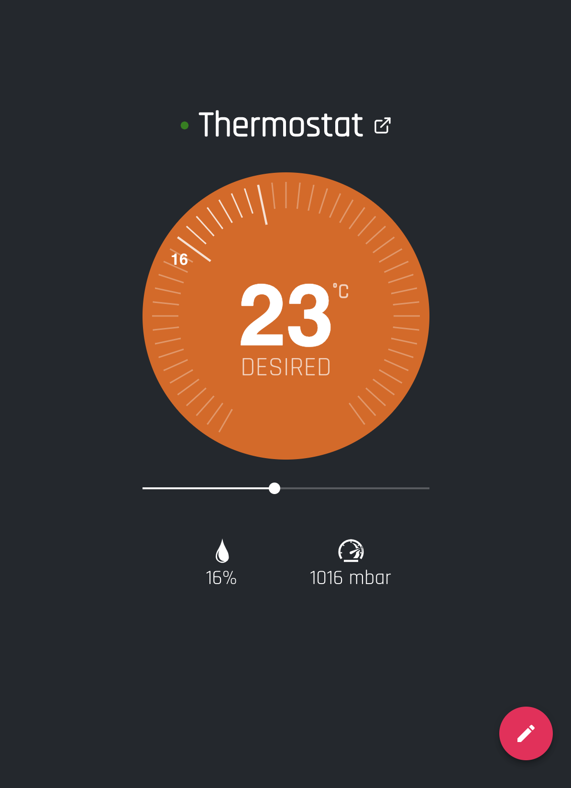

Web Thermostat simulator
=================================

This project contains a source code for [Web Thermostat simulator](https://building-wt.kaaiot.net/) 
that works as a client for [Building Management System](https://www.kaaproject.org/kaa-enterprise-demo/).

It simulates an actual device by connecting to the Kaa platform via MQTT over WebSocket right from your browser.

Explore [MqttUtils.ts](./src/kaa/mqtt/MqttUtils.ts) file to find out how communication with the Kaa Enterprise IoT platform works.

## Available Scripts

In the project directory, you can run:

### `npm start`

Runs the app in the development mode. 
Open [http://localhost:3000](http://localhost:3000) to view it in the browser.